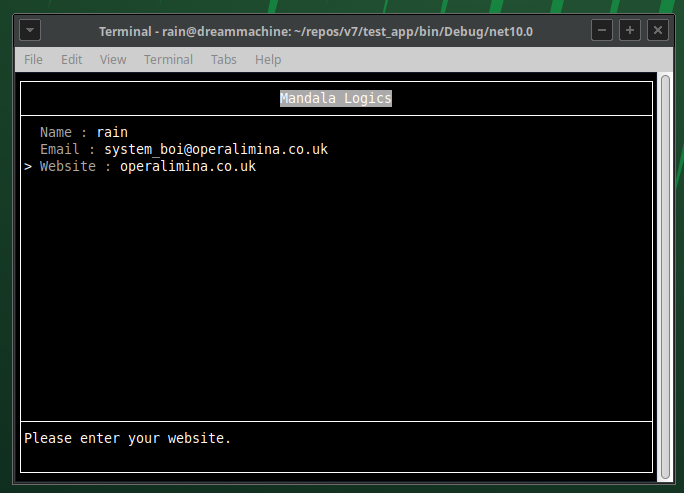

# SurfaceTerminal



## About

SurfaceTerminal is a small experimental framework for building structured console interfaces using composable 2D surfaces.

At its core is a simple abstraction for a rectangular surface of cells (`ISurface<T>`), which can be sliced, layered, and composed together. Surfaces can be combined into composites, trimmed into views, and written to like a grid, making it easy to treat console output as a layoutable canvas rather than a stream of characters.

On top of this surface model, the project includes a layout system for splitting regions, assigning panels, and rendering structured terminal interfaces. The goal is to make it straightforward to build terminal dashboards, tools, and interactive layouts without manually managing cursor positions or redraw logic.

This project is currently experimental and under active development.

## Layout File Apperance

``` md

layout 100x100
    split h -1 
        split h 1
            panel header
            panel main
        panel status_bar

```

## Creating a Layout Using Code

``` csharp
layout = new SurfaceLayout();
        
layout.RootNode.Split(0.5d, LayoutSplitDirection.Horizonal);
```

## Example Project

``` csharp
using MandalaLogics.SurfaceTerminal;
using MandalaLogics.SurfaceTerminal.Layout;
using MandalaLogics.SurfaceTerminal.Parsing;
using MandalaLogics.SurfaceTerminal.Text;

namespace Terminal;

internal static class Program
{
    static void Main(string[] args)
    {
        var sr = CommandHelper.GetAssemblyStreamReader("main.surf");

        var layout = LayoutDeserializer.Read(sr);

        var listDisplay = new ListDisplayPanel();
        
        listDisplay.Add(new TextDisplayLine
        {
            Options = SurfaceWriteOptions.Centered, 
            Decoration = new ConsoleDecoration(null, ConsoleColor.Gray),
            Text = "Mandala Logics"
        });
        
        layout.SetPanel("header", listDisplay);

        var list = new ListPanel
        {
            new PromptLine() { Prompt = "Name" },
            new PromptLine() { Prompt = "Email" },
            new PromptLine() { Prompt = "Website" }
        };
        
        layout.SetPanel("main", list);

        var statusPanel = new TextDisplayPanel();
        
        layout.SetPanel("status_bar", statusPanel);

        statusPanel.Text = "Use the arrow keys to change field.";

        foreach (var line in list)
        {
            line.OnStateChanged += l =>
            {
                if (l.State == SurfaceLineState.Selected)
                    statusPanel.Text = new ConsoleString($"Please enter your {((PromptLine)l).Prompt.ToLower()}.");
            };
        }
        
        SurfaceTerminal.Display(layout);
        
        SurfaceTerminal.Start();
    }
}
```
