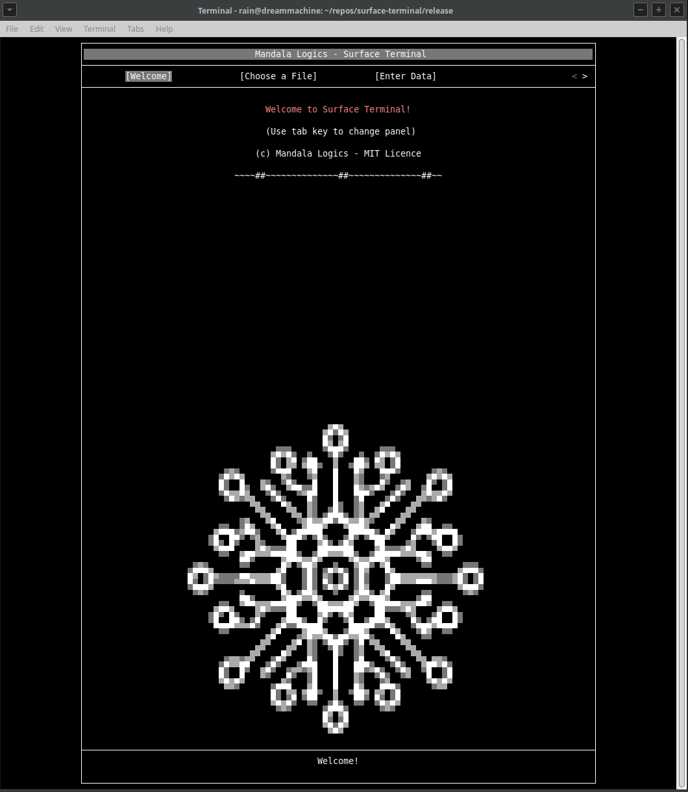
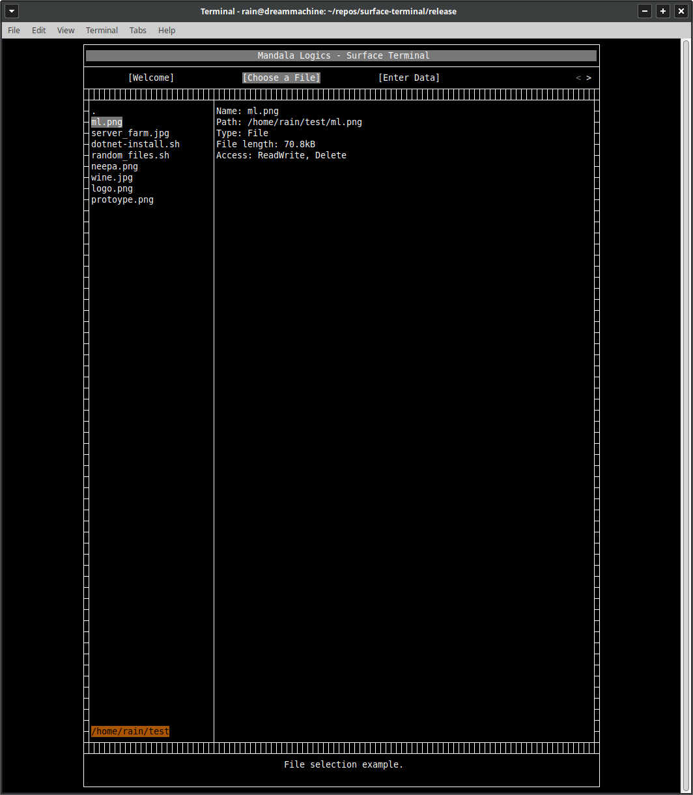

# SurfaceTerminal




## About

SurfaceTerminal is a small experimental framework for building structured console interfaces using composable 2D surfaces.

At its core is a simple abstraction for a rectangular surface of cells (`ISurface<T>`), which can be sliced, layered, and composed together. Surfaces can be combined into composites, trimmed into views, and written to like a grid, making it easy to treat console output as a layoutable canvas rather than a stream of characters.

On top of this surface model, the project includes a layout system for splitting regions, assigning panels, and rendering structured terminal interfaces. The goal is to make it straightforward to build terminal dashboards, tools, and interactive layouts without manually managing cursor positions or redraw logic.

This project is currently experimental and under active development.

## Layout File Apperance

``` md

layout 100x100
    split h -1 
        split h 1
            panel header
            panel main
        panel status_bar

```

## Creating a Layout Using Code

``` csharp
layout = new SurfaceLayout();
        
layout.RootNode.Split(0.5d, LayoutSplitDirection.Horizonal);
```

## Example Project

The example project demonstrates a fully interactive terminal application built using SurfaceTerminal, showcasing how the framework can be used to create structured, multi-panel console user interfaces. The demo includes a tabbed layout with several independent screens: a welcome page with animation and image rendering, a file browser with live metadata display, a data entry form, a configuration panel using toggle and option controls, and an informational “about” screen. Together, these components illustrate layout splitting, nested layouts, interactive input handling, and dynamic rendering — all within a single cohesive application.

The project is intentionally designed to act as a reference implementation rather than a minimal sample. It highlights key features such as switching panels via a TabPanel, embedding layouts using SubLayoutPanel, rendering images directly in the console, and creating animated characters driven by the render frame. For example, the main layout is loaded from a `.surf` file and then wired up programmatically:

```csharp
MainLayout = LayoutDeserializer.Read(sr);

SetUpLayout();

SurfaceTerminal.Display(MainLayout);
SurfaceTerminal.Start();
```

Individual screens are built using composable panels. The welcome screen, for instance, splits the layout and combines centered text with an image panel:

```csharp
WelcomeLayout.RootNode.Split(0.5d, LayoutSplitDirection.Horizonal);

WelcomeLayout.RootNode[1].SetPanel("top", topPanel);
WelcomeLayout.RootNode[2].SetPanel("bottom", logoPanel);
```

This example demonstrates how SurfaceTerminal can be used to construct real-world text-based interfaces with navigation, forms, configuration menus, and dynamic content, making it a practical starting point for building full console applications.

